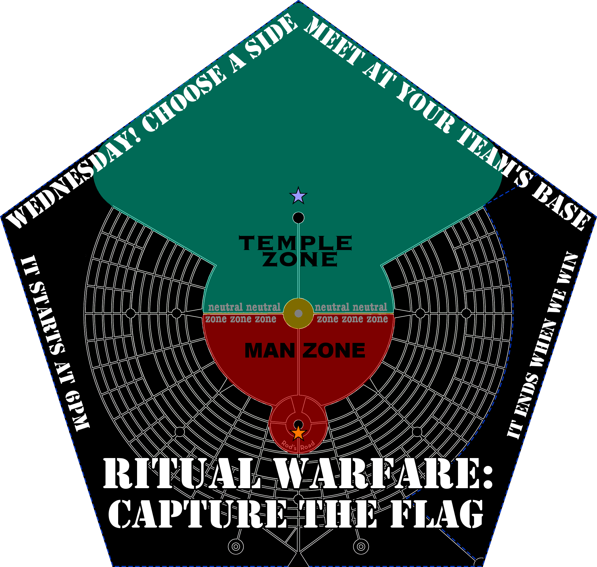

# Rules

## How to join

Choose a team. Meet at your team's base by 6pm on Wednesday.

TEMPLE TEAM's base is behind the Temple - that's 12:00 side, towards deep playa. Look for a giant silver, green, and blue flag.

MAN TEAM's base is behind center camp - that's the 6:00 side of Ring Road, with all the murals. Look for a giant red and orange flag.

## The objective

The game is over when someone wins. A team wins when both flags are flying at their base.

## Active players

An active player must be wearing a WARRIOR SASH. This distinguishes players from the thousands of other participants that have no idea what the hell is going on.

Pick up your WARRIOR SASH at your team's base. They're reversable, wear it with YOUR TEAM's BATTLE CRY facing out, obviously.

## Wait, what's my team's Battle Cry?

MAN ALIVE!HOLD SPACE!

## The field of play

The field of play includes all of Deep Playa between the 10:00 and 2:00 streets, and all of the inner Playa stopping at Esplanade, and only into the City around Center Camp within the circle formed by Rod's Road.

Do not take the fucking flags into the city, we would never find them again. Esplanade is fine, Rod's Road and the area around Center Camp is fine, but only go into Camps within Rod's Road with some concent from the actual human people who are living or working in there.

The field is divided into two TEAM ZONES with a small NEUTRAL ZONE dividing them. The neutral zone includes all of the 9:00 and 3:00 roads between the lantern spires, and all of the space immediately surrounding the Man within whatever Man permimeter that's being inforced this year.

Do not actually try to take the flags into the Temple, into the Man Base, or into Center Camp Cafe. Someone would almost certainly yell at us and they're way too big to get in there anyway.

## Tagging

If you are in the opposing team's ZONE, and an ACTIVE PLAYER from that team is close enough to touch you and they declare "TAG!", then you must surrender your WARRIOR SASH to them. Do not actually touch strangers without their permission&emdash; that would be rude.

You can get a replacement sash from your team's base, or, if your teammate is carrying one that they've captured, they can give it to you.

If you aren't wearing a sash, you are not ACTIVE, which means that you CANNOT TAG and you CANNOT CARRY THE FLAG.

If you are carrying an extra sash, you can give that extra sash to ANY PERSON WHO DOESN'T ALREADY HAVE ONE. SERIOUSLY. ANYBODY.

## Carrying the flag

The flag is big and heavy and it will generally take more than one person to carry it. You must all be wearing WARRIOR SASHES. Seriously. That's how the game works.

If you are carrying the flag, YOU ARE RESPONSIBLE FOR NOT HURTING ANYONE WITH IT. Seriously! This is heavy fucking object! If there is a human being in your way, you cannot go that way!

If you are tagged while carrying the flag, you must stop carrying it. Set it down carefully if your teammates can't continue to lift it without your help. This means that getting the flag out of the opposing team's zone will be REALLY HARD.

## Ettiquette and Safety

This is Burning Man. Fire is still hot, heavy things can still fall down, getting hit by a vehicle is still unpleasant.

Don't fucking touch anyone without their permission.

Especially don't fucking touch someone with a giant piece of lumber that has a giant bullshit flag attached to one end.

Respect the idea that other people do not necessarily know or care about what you are trying to do.

If you are trying to interact with an art car in some game-related way, talk to the fucking driver about what you're tring to do. They're in charge of their situation.

## Rules in Unforseen Circumstances

I guess you'll have to argue about it. Good luck. Or you could try raising the game coordinates by shouting! Or maybe radio?

## Radio

Is there any chance enough of us will have functioning Walkie Talkies that it's worth setting them up? No!

Are we gonna try anyway? Yeah okay.

* Game-wide channel: MURS Channel 1, Subchannel CTCSS 123.0 (also known as subchannel 18 or 3Z)
* MAN TEAM channel: MURS Channel 2, Subchannel CTCSS 123.0 (also known as subchannel 18 or 3Z)
* TEMPLE TEAM channel: MURS Channel 3, Subchannel CTCSS 123.0 (also known as subchannel 18 or 3Z)

Lots of cheapo radios can monitor two channels at a time. Do the obvious thing.

## Is this going to work?

I have no idea. I hope so. I hope we can make enough fucking sashes. I hope people show up. I hope people aren't assholes.

## Um, can I talk to you about all this?

Shit. I guess since I made this website I better take some responsibility. Ok. Email me at jes5199@gmail.com
